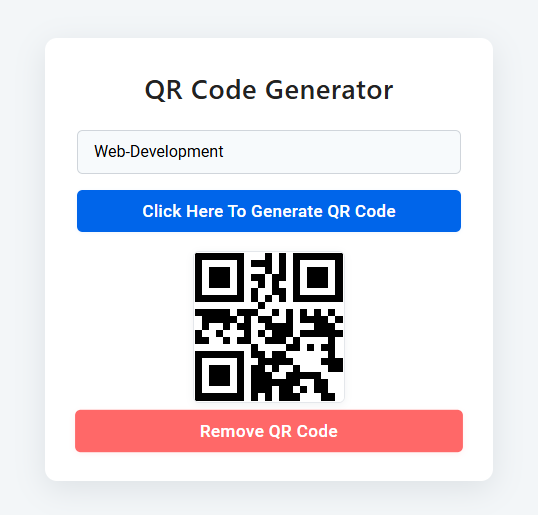
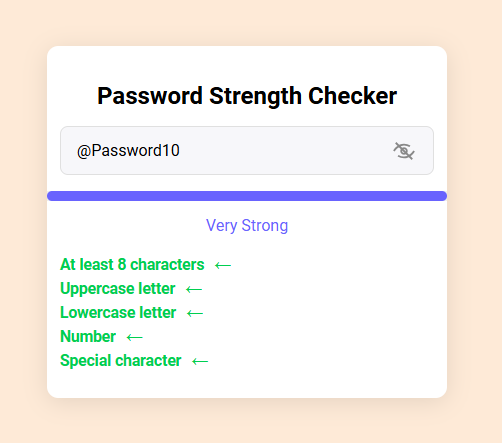

# 🧪 Frontend Mini Projects Collection

A collection of beginner-to-intermediate frontend utilities built using HTML, CSS, and JavaScript. This repo demonstrates real-world logic, DOM manipulation, and UI feedback in small, functional web apps.

---

## 📦 Included Projects

### 1. 📲 QR Code Generator

**Description:**  
Convert any text input into a scannable QR code instantly. Built using a public QR API.

**🛠 Features:**
- Input any string or URL to generate a QR code
- Real-time generation

---

### 2. 🔐 Password Strength Checker

**Description:**  
This dynamic password validator checks for:
- At least 8 characters
- At least one uppercase letter  
- At least one lowercase letter  
- At least one number  
- At least one special character  

It updates live as you type, using a color-coded progress bar to indicate the password strength from **weak** to **very strong**.

**🛠 Features:**
- Live validation feedback
- Progress bar with color states (red, yellow, blue)
- Instructional messages based on input
  
---

## 🚀 Tech Stack

- HTML5
- CSS3
- Vanilla JavaScript

---

## 🗂️ Folder Structure

Frontend-mini-apps/
│
├── 1_QR_code_generator/
│   └── index.html, style.css, script.js
│
└── 2_Password_strenth_indicator/
    └── index.html, style.css, script.js

## 💡 Using This Repo

This repo is intended solely for portfolio and educational purposes. Please give credit if you reference or reuse the code

Clone the repo: git clone https://github.com/askdanish144/Frontend-mini-apps.git

---

## ✨ Author

Crafted with attention to detail by **Danish Ali – Full Stack Developer & Graphic Designer**

GitHub: https://github.com/askdanish144

---

## 📬 Want a website?

I'm available to build responsive, business-focused websites tailored to any industry, whether you're a startup, local business, or growing brand.
➤ Email me at `askdanish144@gmail.com` to start a conversation.
